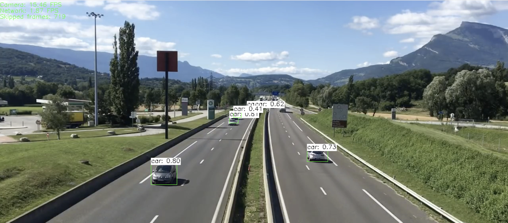

# YOLO Object Detection

This project is the Capstone project in the [Udacity C++ Nanodegree Program][C++ Nanodegree].
It aims to detect objects from an image or sequence of frames from a video by using the You Only Look Once (YOLO) Deep Neural Network.

Furthermore, this project follows Object Oriented Programming (OOP) and the latest C++ features (e. g. STL threads, locks, smart pointers).




## Installation

The core of the project is OpenCV and the Intel Inference Engine from OpenVINO.
You can find more documentation about these two projects in [here][OpenCV] and [here][OpenVINO] respectively.

### Supported Operating Systems

OpenCV is supported in almost every operating system. On the other hand, OpenVINO only supports Linux and 
macOS up to version 10.13. Nevertheless, this project works for 10.15 as well.

- Ubuntu 16.04 LTS or later.
- macOS 10.15.

### Dependencies

- cmake >= 3.11
- make >= 4.2 (Linux, Mac)
- gcc/g++ >= 9.2
- OpenCV >= 4.1.2
- OpenVINO >= 2019_R3.1
- yaml-cpp >= 0.6.3

### Requisites

#### Models

Model weights can be downloaded with this [script][Models downloader].

A good place to store these models is `resources/` under a `models/` directory that you have to create.

#### OpenCV and OpenVINO.

In order to install both libraries you can follow these installation links below.

- [OpenVINO for macOS installation guide][OpenVINO for macOS].
- [OpenVINO for Linux installation guide][OpenVINO for Linux].

**Note**: macOS is only supported until version 10.13. However, this project works with 10.15 even if the installer says it's not supported.

### Build instructions

1. Clone this repo.

With SSH

```bash
git clone git@github.com:alvgaona/yolo-object-detection.git --recurse-submodules
```

With HTTPS

```bash
git clone https://github.com/alvgaona/yolo-object-detection.git --recurse-submodules
```

This project relies on [googletest][Google Test] as a thirdparty library.

2. Compile the project.

```bash
make build
```

Look into the [Makefile][Makefile] to see how the app is built.

3. Run it.

Go to [usage](#usage).

## Tests

The tests are implemented using [googletest][Google Test] framework.
These can be found under `test/` directory.

## Coding style

Coding style is addressed by using `clang-format` tool and the configuration can be found in [.clang-format].
This inherits Google's style rules plus a minor change.
The documentation regarding Google's convention can be found in this [site][Google C++ Style Guide].

## Usage

Once built the binary can parse inputs such as a configuration file and the input for the
system.

**Parameters**

* `input`: Absolute path to a resource (image or video).
* `configuration`: Name of a YAML file.

**How to run it**

```bash
./build/yolo_object_detection \
 --configuration=conf.yml \
 --input=$(realpath resources/videos/overpass.mp4)
```

## License

[MIT][MIT]

## Class structure

You can find it in [here][Class structure].


## Rubric points met

### Loops, Functions, I/O

| Point                                                                                          | File       | Lines          |
|------------------------------------------------------------------------------------------------|------------|----------------|
| The project demonstrates an understanding of C++ functions and control structures.             | all        | -              |
| The project reads data from a file and process the data, or the program writes data to a file. | [main.cpp] | 11-15          |
| The project accepts user input and processes the input.                                        | [main.cpp] | 8,10,17        |

### Object Oriented Programming

| Point                                                                            | File                   | Lines          |
|----------------------------------------------------------------------------------|------------------------|----------------|
| The project uses Object Oriented Programming techniques.                         | all                    | -              |
| Classes use appropriate access specifiers for class members.                     | all                    | -              |
| Class constructors utilize member initialization lists.                          | [detection_output.cpp] | 3              |
| The project follows the Rule of 5.                                               | all                    | -              |
| Classes abstract implementation details from their interfaces.                   | [region.cpp]           | 5              |
| Classes encapsulate behavior.                                                    | [model.h], [model.cpp] | -              |
| Classes follow an appropriate inheritance hierarchy.                             | all                    | -              |
| Overloaded functions allow the same function to operate on different parameters. | -                      | -              |
| Derived class functions override virtual base class functions.                   | [detection_output.h]   | 13             |
| Templates generalize functions in the project.                                   | [queue_fps.h]          | -              |

### Memory Management

| Point                                                                                     | File            | Lines          |
|-------------------------------------------------------------------------------------------|-----------------|----------------|
| The project makes use of references in function declarations.                             | all             | -              |
| The project uses destructors appropriately.                                               | all             | -              |
| The project uses scope / Resource Acquisition Is Initialization (RAII) where appropriate. | [model.cpp]     | 32-34          |
| The project follows the Rule of 5.                                                        | all             | -              |
| The project uses move semantics to move data, instead of copying it, where possible.      | [model.cpp]     | 6-8            |
| The project uses smart pointers instead of raw pointers.                                  | [yolo.cpp]      | 38-42          | 

### Concurrency

| Point                                        | File            | Lines          |
|----------------------------------------------|-----------------|----------------|
| The project uses multithreading.             | [yolo.cpp]      | 27, 28, 47, 49 |
| A promise and future is used in the project. | -               | -              |
| A mutex or lock is used in the project.      | [queue_fps.h]   | 25, 36, 48, 64 |
| A condition variable is used in the project. | -               | -              |   


[Class structure]: docs/ClassStructure.md
[.clang-format]: ./.clang-format
[MIT]: ./LICENSE
[Makefile]: ./Makefile

[Google C++ Style Guide]: https://google.github.io/styleguide/cppguide.html
[Google Test]: https://github.com/google/googletest
[Models downloader]: https://github.com/opencv/opencv_extra/blob/master/testdata/dnn/download_models.py
[OpenCV]: https://opencv.org/
[OpenVINO]: https://software.intel.com/en-us/openvino-toolkit
[C++ Nanodegree]: https://www.udacity.com/course/c-plus-plus-nanodegree--nd213

[main.cpp]: src/main.cpp
[yolo.cpp]: src/yolo.cpp
[queue_fps.h]: ./include/queue_fps.h
[model.cpp]: src/model/model.cpp
[model.h]: include/model/model.h
[detection_output.h]: include/model/detection_output.h
[detection_output.cpp]: src/model/detection_output.cpp
[region.h]: include/model/region.h
[region.cpp]: src/model/region.cpp

[OpenVINO for Linux]: https://docs.openvinotoolkit.org/latest/_docs_install_guides_installing_openvino_linux.html
[OpenVINO for macOS]: https://docs.openvinotoolkit.org/latest/_docs_install_guides_installing_openvino_macos.html
